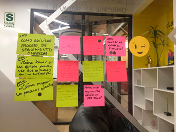

# Proyecto Design Sprint 

**Proceso**: Colocación Laboral de Laboratoria  
**Usuarios**: Job Placement Managers (Gerentes de Colocación Laboral)  
**Reto**: Agregar valor al rol de JPM  

## Contexto
Los Job Placement Managers (JPMs) se encargan de gestionar la etapa de colocación de las egresadas en las diferentes sedes de Laboratoria. Ellxs gestionan todo el proceso, desde identificar posibles empresas empleadoras, generar el vínculo con ellas, invitarlas al Talent Fest, recomendarles talento, hacer seguimiento de las entrevistas y registrar la data importante que alimenta los indicadores de Laboratoria. 

Actualmente, tenemos una herramienta que hace más fácil el proceso de registrar la data, que es un web-app al cual los JPMs acceden en cualquier momento y en cualquier lugar, que nos va a permitir tener siempre los indicadores al día en Laboratoria. 

## Reto
Entender cómo y en qué momento del proceso podemos seguir agregándoles valor a los JPMs para que el tiempo que tienen lo puedan invertir, a su vez, en generar más valor para Laboratoria.

## Lunes (Mapear)

### *Meta a largo plazo:*  
Que los JPMs realicen un trabajo menos operativo (más estratégico) con ayuda de herramientas.

### *Preguntas del Sprint:*
- ¿Será necesario contratar personal extra para descargar el trabajo de las y los JPMs?
- ¿Cómo demostrar la validadez, usabilidad y valor de la aplicación?

### *Mapa del proceso de colocación laboral:*  

 

### *Preguntas a expertos con Andrea Lamas, Product Director: Job Placement de Laboratoria*:  

 
 
 

### *Principales 'How might we...':*

- Reflejar en los perfiles el match cultural que las egresadas tienen con la empresa que busca talento?
- Concientizar a las egresadas para que comuniquen los procesos de selección o postulaciones a las que se están presentando?
- Transmitir exclusividad?
- Evitar que las empresas se salten los pasos del proceso y contacten directamente a las egresadas?
- Fomentar el uso de la App de Talento por parte de las empresas?
- Reflejar el seguimiento en tiempo real de los procesos que sigue la egresada y los resultados?
- Agilizar y reducir la operatividad de los procesos de seguimiento de colocación laboral?

### *Objetivo priorizado:*  

Reducir la operatividad de los procesos de seguimiento de colocación laboral de las egresadas de Laboratoria.

## Martes (Sketchar)

### *Lighting demos:*  
(Fotografías de las principales ideas rescatadas)

### *Ideas:*  
1. Tener acceso a data histórica por empresa y egresada; asimismo, observar datos de contacto y enlace para contactarse con representante de Recursos Humanos.
2. Integra Google Calendar, Slack y LinkedIn para generar citas de entrevistas de forma rápida y automática.
3. Sección que permite dar y recibir feedback de los procesos por cada estudiantes, de forma sencilla, a través de tópicos generales.
4. Sección que permite filtrar por empresa o candidata los procesos y status, eliminando de forma automática a quienes no continuan por finalización de contraro y otro factor.
5. Sección que permite ubicar candidata que hace match con los valores y/cultura de la organización.
6. Aplicación que ofrece valor a empresas y permite generar más entradas para obtener data que pueda analizarse.
7. Sección que permite visualizar a tiempo real el status y momento del proceso en general que tiene cada egresada.
8. Continuará...

### *Crazy 8s:*  
(Fotografías de los bocetos)

### *Propuestas preliminares - Solución en 3 pasos:*  
(Fotografías de las 3 propuestas)

## Miércoles (Decidir)

### *Museo de arte:*  
Colocamos en fila las propuestas preliminares en la pared como si fueran cuadros de un museo con el fin que sean observados de forma objetiva por todos los miembros del equipo para luego destacar con stickers, en silencio, a cualquiera de las ideas interesantes que abrió paso a prepararnos para tomar decisiones. 

Asimismo, a partir de la explicación de cada propuesta por parte de la Facilitadora y la explicación de los creadores de los bocetos para no dejar pasar ningún detalle, las miembros del equipo procedimos a elegir la(s) idea(s) o una parte de la misma con más potencial donde la decisión final la tuvo la Product Director.

### *Decisión - Ideas priorizadas:*  
(Fotografía de la/las ideas priorizadas o explicación de las razones por las que se elige)

### *Storyboard:*  
(Fotografías del proceso y/o el producto final)

## Jueves (Prototipar)

###  *Prototipo:*

Prueba el prototipo en el siguiente [enlace](https://marvelapp.com/478d097/screen/56185707).

## Viernes (Testear) 

### *Conclusiones sobre sección `Dashboard`:*
- Calendario debería ser clickeable y anexar a las otras secciones.
- Prefieren usar el calendario de Google.
- En vez de mostrar las fechas de forma diaria, les gustaría tener algo que se asemeje a un planificador mensual.
- Les gustaría poder incluir reuniones programadas con empresas, no solo las entrevistas agendadas a egresadas.
- El dashboard no transmite la idea de que es una agenda.
- Se preguntan cómo se vería el dashboard si en un día tienen programadas más de 3 reuniones.
- Dashboard de empleabilidad debería mostrar data general y no por generaciones.

### *Conclusiones sobre sección `Empresas`:*
- Algunos JPMs ya tiene mapeados los contactos de las empresas y no les genera valor tenerlos en la aplicación.
- Desean poder tener un banco de datos que albergue información variada y de valor sobre las empresas, que ayude a reducir el tiempo en investigar sobre cada una.
- Detalles de contacto que más requieren: foto no es relevante, correo, teléfono, whatsapp, anotar si el contacto ya no labora en la empresa, descripción de las posiciones o cargos.
- El nombre "notas" no se entiende y no transmite el objetivo de la sección con claridad.

- Sobre la sección "notas", prefieren tener un historial (como una historia clínica) que refleje la relación con la empresa antes que solo anotaciones que no ofrezcan información sobre los touchpoints con dicha entidad que les ayuden a comprender cómo se ha ido desarrollando esa relación y entenderles mejor.
- Poder visualizar empresas con mayor presencia o relaciones más cercanas con Laboratoria y tener información del status actual de la relación con la empresa.
- Agregar recomendaciones sobre la relación que se tiene con algunos contactos o personas de confianza dentro de la empresa.
- Posibilidad de etiquetar favoritos entre los contactos de una empresa y colocar anotaciones sobre cada uno que ayuden a recordar la relación generada con dicha persona.
- Mayor detalle sobre las posiciones o puestos que ofrecen las empresas.

### *Conclusiones sobre sección `Egresadas`:*
- Palabra "histórico" no se entiende a qué se refiere.
- Sección "histórico" debe incluir información sobre trabajos anteriores, procesos actuales en los que se encuentra, experiencia e historial por fechas.
- Sección "Otros datos" da a entender que son datos irrelevantes.
- Sobre filtros para ubicar egresadas, desean ver: por generación, idiomas, habilidades soft, países y ubicación en vez de distrito que es una palabra que no se entiende en todos los países.
- Poder saber de forma automática si la egresada aceptó alguna oferta.
- Alerta cuando la egresada ha superado 5 procesos seguidos que no hay superado.
- Incluir información detallada sobre es estado actual de la egresada y dar mayor información sobre background y conocimientos adicionales para realizar recomendaciones.

## Conclusiones y retrospectiva del Sprint:
(A ver, a ver, quién dice yo xD)
